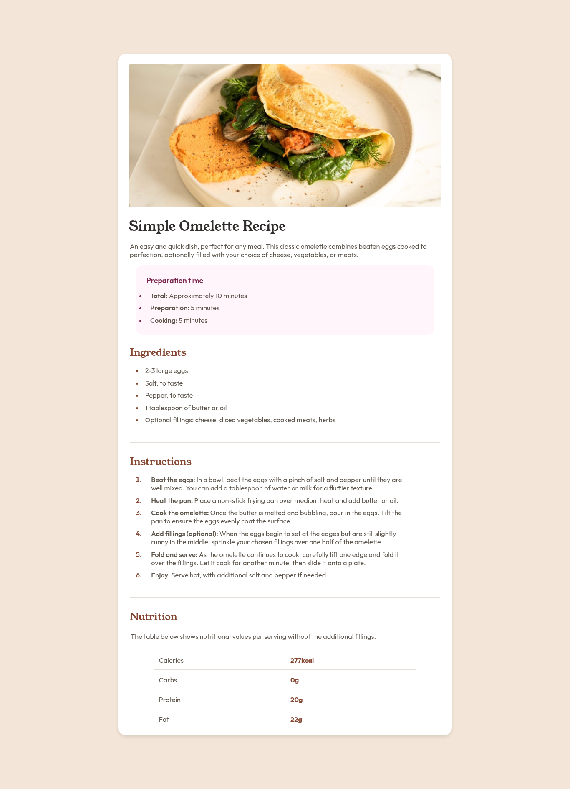

# Frontend Mentor - Recipe page solution

This is a solution to the [Recipe page challenge on Frontend Mentor](https://www.frontendmentor.io/challenges/recipe-page-KiTsR8QQKm). Frontend Mentor challenges help you improve your coding skills by building realistic projects. 

## Table of contents

- [Overview](#overview)
  - [The challenge](#the-challenge)
  - [Screenshot](#screenshot)
  - [Links](#links)
- [My process](#my-process)
  - [Built with](#built-with)
  - [What I learned](#what-i-learned)
  - [Continued development](#continued-development)
  - [Useful resources](#useful-resources)
- [Author](#author)

## Overview

### Screenshot

### Links

- Solution URL: [github repo]
- Live Site URL: [recipe page]

## My process

### Built with

- Semantic HTML5 markup
- CSS custom properties
- Flexbox

## Author

- Frontend Mentor - [@thesyntaxdude](https://www.frontendmentor.io/profile/thesyntaxdude)
- Twitter - [@thesyntaxdude](https://www.twitter.com/thesyntaxdude)

[github repo]: <https://github.com/thesyntaxdude/recipe-page-main>
[recipe page]: <https://thesyntaxdude.github.io/recipe-page-main>